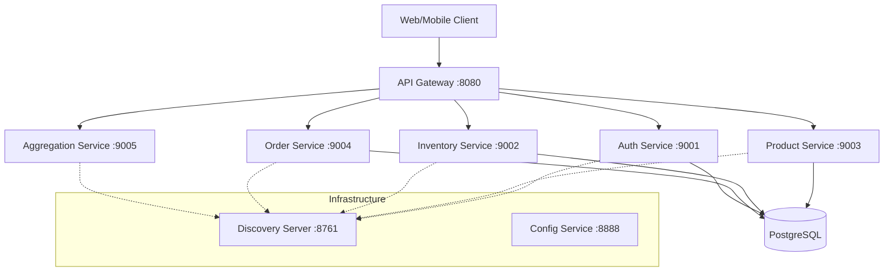

# E-commerce Microservices Application

A robust, scalable e-commerce platform built using Spring Boot and Spring Cloud microservices architecture. This project demonstrates centralized configuration, service discovery, API gateway routing, and distributed data management.

## 🏗️ Architecture



## 🚀 Services Overview

| Service | Port | Description |

| **Discovery Server** | 8761 | Netflix Eureka for service registration and discovery. |
| **Config Service** | 8888 | Centralized configuration management using Spring Cloud Config. |
| **API Gateway** | 8080 | Single entry point, handling routing and global filters. |
| **Auth Service** | 9001 | Security service handling JWT-based authentication. |
| **Product Service** | 9003 | Manages product catalog and details. |
| **Inventory Service** | 9002 | Manages stock levels and availability. |
| **Order Service** | 9004 | Handles order placement and processing. |
| **Aggregation Service**| 9005 | Combines data from multiple services for complex views. |

## 🛠️ Tech Stack

- **Backend**: Java 17+, Spring Boot 3.x, Maven
- **Microservices**: Spring Cloud (Gateway, Eureka, Config)
- **Database**: PostgreSQL
- **Security**: JWT (JSON Web Tokens)
- **Containers**: Docker, Docker Compose

## 🚦 Getting Started

### Prerequisites

- Java 17 or higher
- Maven 3.6+
- Docker & Docker Compose
- Git

### Running with Docker (Recommended)

1. Clone the repository:
   ```bash
   git clone https://github.com/YOUR_USERNAME/ecommerce-microservices.git
   cd ecommerce-microservices
   ```
2. Build the services:
   ```bash
   mvn clean package -DskipTests
   ```
3. Start the infrastructure and services:
   ```bash
   docker-compose up -d
   ```
4. Access the Discovery dashboard at [http://localhost:8761](http://localhost:8761).

### Running Manually

Ensure PostgreSQL is running locally with the required databases (`authdb`, `inventorydb`, `productdb`, `orderdb`).

Sequence of startup:
1. `discovery-server`
2. `config-service`
3. All other services (`auth`, `product`, `inventory`, `order`, `aggregation`, `api-gateway`)

## 📖 API Documentation

The project uses OpenAPI (Swagger) for API documentation. Once a service is running, you can access its UI at:
`http://localhost:<service-port>/swagger-ui/index.html`
